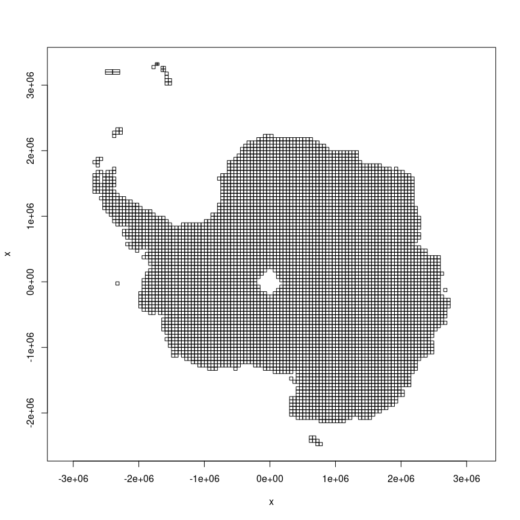
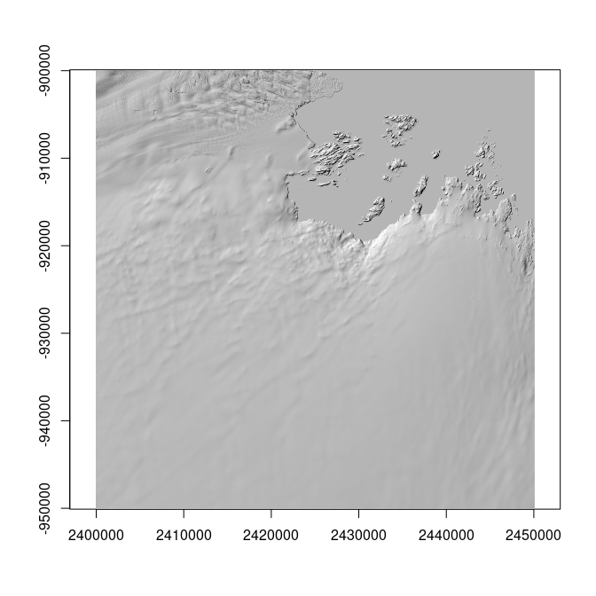
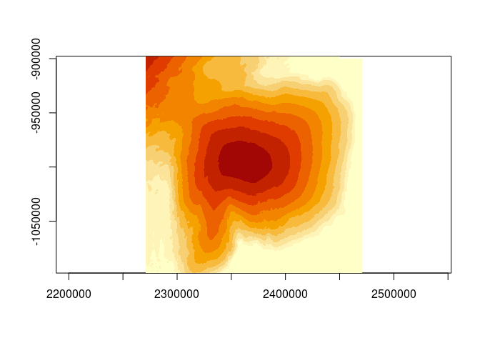

<!-- README.md is generated from README.Rmd. Please edit that file -->

# remav2

<!-- badges: start -->

[](https://github.com/AustralianAntarcticDivision/remav2/actions/workflows/R-CMD-check.yaml)
<!-- badges: end -->

The goal of remav2 is to provide access to the The Reference Elevation
Model of Antarctica (REMA) v2 via its mosaic index. The index has been
augmented to included geographic extent (xmin, xmax, ymin, ymax) and the
actual GeoTIFF urls needed to read and interrogate the actual data with
minimal fuss and plumbing.

## Installation

You can install the development version of remav2 from
[GitHub](https://github.com/) with:

``` r
# install.packages("devtools")
devtools::install_github("AustralianAntarcticDivision/remav2")
```

## Example

This is a basic example.

Everything we need is in this index table.

``` r
library(remav2)
library(dplyr)
#> 
#> Attaching package: 'dplyr'
#> The following objects are masked from 'package:stats':
#> 
#>     filter, lag
#> The following objects are masked from 'package:base':
#> 
#>     intersect, setdiff, setequal, union
(index <- remav2_index())
#> # A tibble: 5,800 × 16
#>    dem_id        tile      xmin     xmax     ymin     ymax s3url data_…¹ num_c…²
#>    <chr>         <chr>    <dbl>    <dbl>    <dbl>    <dbl> <chr>   <dbl>   <int>
#>  1 41_40_2_2_2m… 41_40   949900  1000100  1049900  1100100 http… 0.87051      86
#>  2 41_40_2_1_2m… 41_40   899900   950100  1049900  1100100 http… 0.93290     148
#>  3 41_40_1_2_2m… 41_40   949900  1000100   999900  1050100 http… 0.89323     129
#>  4 41_40_1_1_2m… 41_40   899900   950100   999900  1050100 http… 0.88104      80
#>  5 18_23_2_1_2m… 18_23  -800100  -749900 -1250100 -1199900 http… 0.99238     147
#>  6 18_23_1_1_2m… 18_23  -800100  -749900 -1300100 -1249900 http… 0.78005      93
#>  7 18_23_1_2_2m… 18_23  -750100  -699900 -1300100 -1249900 http… 0.48723      86
#>  8 18_23_2_2_2m… 18_23  -750100  -699900 -1250100 -1199900 http… 0.95989     165
#>  9 29_14_1_1_2m… 29_14 -1700100 -1649900  -200100  -149900 http… 0.99462      76
#> 10 29_14_2_1_2m… 29_14 -1700100 -1649900  -150100   -99900 http… 0.98564      54
#> # … with 5,790 more rows, 7 more variables: cog_browse <chr>, cog_dem <chr>,
#> #   cog_count <chr>, cog_countmt <chr>, cog_mad <chr>, cog_maxdate <chr>,
#> #   cog_mindate <chr>, and abbreviated variable names ¹​data_percent,
#> #   ²​num_components
```

We can visualize the coverage of the tiles with their extents.

``` r
xlim <- range(unlist(index[c("xmin", "xmax")]))
ylim <- range(unlist(index[c("ymin", "ymax")]))
plot(NA, xlim = xlim, ylim = ylim, xlab = "x", ylab = "x", asp = 1)
rect(index$xmin, index$ymin, index$xmax, index$ymax)
```



REMA v2 is an intensely detailed product, each of these tiles represents
a raster grid with dimensions 25100x25100, with resolution of 2m.

We can interrogate a specific place by finding the tile of interest.

``` r
## Casey station
pt <- cbind(2447000, -916300)
library(dplyr)
tile0 <- index |> filter(xmin <= pt[1], xmax >= pt[1], 
                         ymin <= pt[2], ymax >= pt[2])
tile0 |> dplyr::transmute(tile, data_percent, tif =  basename(cog_dem), xmin, xmax, ymin, ymax)
#> # A tibble: 1 × 7
#>   tile  data_percent tif                          xmin    xmax    ymin    ymax
#>   <chr>        <dbl> <chr>                       <dbl>   <dbl>   <dbl>   <dbl>
#> 1 21_55      0.69859 21_55_2_1_2m_v2.0_dem.tif 2399900 2450100 -950100 -899900
```

Now get an image from the browse file.

``` r
#devtools::install_github(c("hypertidy/whatarelief", "hypertidy/ximage"))
library(whatarelief)
library(ximage)
ex0 <- unlist(tile0[c("xmin", "xmax", "ymin", "ymax")])
im <- imagery(source = tile0$cog_browse, extent = ex0, dimension = c(1024, 1024), projection = "EPSG:3031")
ximage(im, extent = ex0, asp = 1)
```



Ah but … how do we choose that ‘pt’ location in Polar Stereographic on
the south pole with true scale latitude 72S oriented to longitude 0 (aka
‘EPSG:3031’)?

Well, it’s Casey station- we googled its longlat, and converted to
‘EPSG:3031’.

``` r
reproj::reproj_xy(cbind(110.5285, -66.2821), "EPSG:3031", source = "OGC:CRS84")
#>        x_        y_ 
#> 2447033.3 -916295.9
```

With that in mind, let’s go for another location and get data for a
broader region.

``` r
ld <-   cbind(112.826, -66.643)
pt <- reproj::reproj_xy(ld, "EPSG:3031", source = "OGC:CRS84")
ex <- c(-1, 1, -1, 1) * 1e5 + rep(pt, each = 2)
## we can do *this*, but it takes too long
#dsm <- imagery(source = index$cog_dem, extent = ex, dimension = c(1024, 1024), projection = "EPSG:3031")
tile1 <- index |> dplyr::filter(pmax(xmin, xmax) > ex[1], 
                       pmin(xmin, xmax) < ex[2], 
                       pmax(ymin, ymax) > ex[3], 
                       pmin(ymin, ymax) < ex[4] 
                       )

dim(tile1)
#> [1] 24 16
dsm <- elevation(source = tile1$cog_dem, extent = ex, dimension = c(1024, 1024), projection = "EPSG:3031")
ximage(dsm, extent = ex, asp = 1)
```



Of course, like other massive raster data sets this one is tiled and has
overviews only within each tile so we can’t efficiently treat it like a
single data set, it’s better for larger regions to go for the prepared
lower resolution sources (a WIP for us to combine these levels).

## WIP

TODO

-   [ ] index the other resolutions
-   [ ] integrate with a spatial helper package

## Code of Conduct

Please note that the remav2 project is released with a [Contributor Code
of
Conduct](https://contributor-covenant.org/version/2/1/CODE_OF_CONDUCT.html).
By contributing to this project, you agree to abide by its terms.
